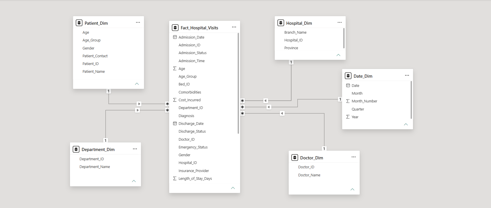
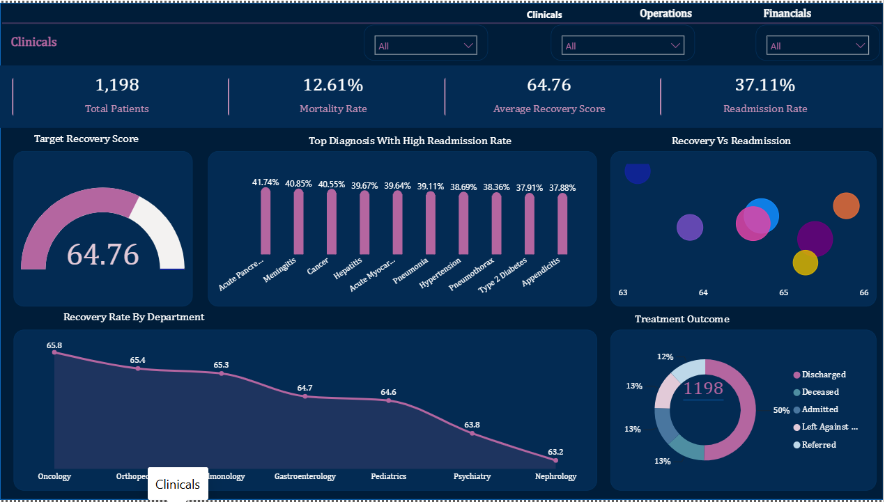
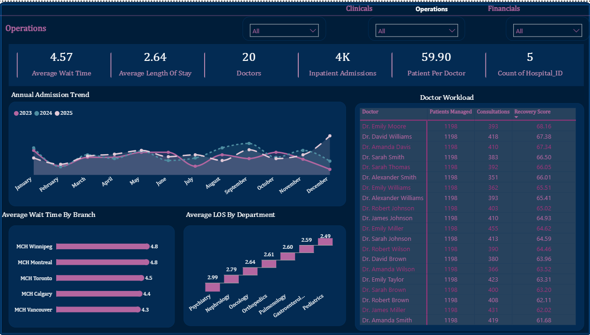
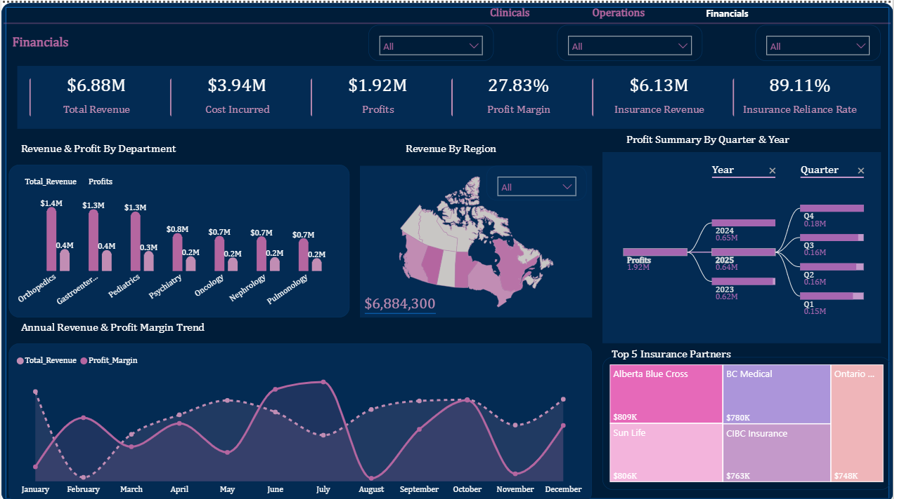

# MapleCare: Clinical, Operations & Financial Performance Dashboard

📊 **Tool:** Power BI | **Domain:** Healthcare | **Data:** MapleCare Health Network, 5 branches across Canada

*A two-part case study: (1) transforming a flat-file hospital dataset into a Star Schema data model with DAX-driven KPIs, and (2) designing an executive Power BI dashboard on top of it.*

## Project Background

MapleCare Health Network runs five hospital branches across Ontario, British Columbia, Alberta, Quebec, and Nova Scotia, offering inpatient, outpatient, emergency, diagnostic, and specialised care. As the network grew, its operational data stayed in a single large, denormalised Excel file , which made it increasingly hard for leadership to track branch performance, patient outcomes, doctor workload, and financial sustainability, or to trust the reporting coming out of it.

## Business Questions Answered

**Operations**
- How has patient admission volume changed over time?
- Which branches have the longest wait times?
- Which doctors manage the highest patient volumes?
- Which departments have the longest average length of stay?

**Clinical & Patient Outcomes**
- Which departments have the highest recovery rates?
- Which diagnoses are associated with the highest readmission rates?
- Is there a relationship between recovery outcomes and readmission across departments?
- What proportion of patients are discharged, referred, deceased, or still under treatment?

**Cost & Financial**
- Is revenue increasing or decreasing over time?
- Which branches generate the highest revenue and profit?
- Which insurance providers contribute the largest share of revenue?
- Which branches convert revenue into profit most efficiently?
- Which departments incur the highest treatment costs?

## Data

- **Source:** MapleCare internal hospital operations dataset (flat Excel file), 2023–2025
- **Scope:** 1,198 patients, 3,942 admissions, 60 doctors, 5 branches across 5 provinces

## Data Modelling

Transformed the flat file into a Star Schema in Power BI (via Power Query) , one central fact table connected to five dimension tables , to improve model performance, simplify maintenance, and support efficient reporting.



| Table | Type | Key Fields |
|---|---|---|
| `Fact_Hospital_Visits` | Fact | Admission_ID, Patient_ID, Doctor_ID, Department_ID, Hospital_ID, Admission/Discharge dates, Diagnosis, Comorbidities, Cost_Incurred, Length_of_Stay_Days, Emergency_Status, Insurance_Provider |
| `Patient_Dim` | Dimension | Patient_ID, Age, Age_Group, Gender |
| `Doctor_Dim` | Dimension | Doctor_ID, Doctor_Name |
| `Department_Dim` | Dimension | Department_ID, Department_Name |
| `Hospital_Dim` | Dimension | Hospital_ID, Branch_Name, Province |
| `Date_Dim` | Dimension | Date, Month, Month_Number, Quarter, Year |

Derived fields created in Power Query included Age_Group, Wait_Time_Group, and Recovery_Group, used to standardise and simplify analysis.

## Dashboard

**3 report pages**, cross-filterable via Clinicals / Operations / Financials navigation:

### 1. Clinicals


KPIs: 1,198 Total Patients · 12.61% Mortality Rate · 64.76 Average Recovery Score · 37.11% Readmission Rate
- Target Recovery Score (gauge)
- Top Diagnosis with High Readmission Rate (bar chart) , led by Acute Pancreatitis (41.74%) and Meningitis (40.85%)
- Recovery vs. Readmission (scatter chart)
- Recovery Rate by Department (line chart) , Oncology highest (65.8), Nephrology lowest (63.2)
- Treatment Outcome (donut chart) , 50% Discharged, remainder split across Deceased, Admitted, Left Against Advice, Referred

### 2. Operations


KPIs: 4.57 Average Wait Time · 2.64 Average Length of Stay · 20 Doctors · 3,942 Admissions · 59.90 Patients per Doctor · 5 Hospitals
- Annual Admission Trend by year (line chart)
- Average Wait Time by Branch (bar chart) , Manitoba/Quebec highest (4.8), British Columbia lowest (4.3)
- Length of Stay by Department (step chart) , Psychiatry highest (2.99 days), Pediatrics lowest (2.49 days)
- Doctor Workload table , patients managed, consultations, recovery score per doctor

### 3. Financials


KPIs: $6.88M Total Revenue · $3.94M Cost Incurred · $1.92M Profit · 27.83% Profit Margin · $6.1M Insurance Revenue · 89.11% Insurance Reliance Rate
- Revenue & Profit by Department (bar chart) , Orthopedics highest ($1.4M revenue), Pulmonology lowest ($0.7M)
- Revenue by Region (map of Canada)
- Annual Revenue & Profit Margin Trend (line chart)
- Top 5 Insurance Partners , Alberta Blue Cross ($809K), BC Medical ($780K), Private, Sun Life ($806K), CIBC Insurance (~$750K)

## Key DAX Measures

```dax
Avg_Recovery_Score = AVERAGE(Fact_Hospital_Visits[Recovery_Score])

Avg_LOS = AVERAGE(Fact_Hospital_Visits[Length_of_Stay_Days])

Avg_Wait_Time = AVERAGE(Fact_Hospital_Visits[Wait_Time_Days])

Cost_Incurred = SUM(Fact_Hospital_Visits[Cost_Incurred])

Deceased_Patients = CALCULATE(
    DISTINCTCOUNT(Fact_Hospital_Visits[Patient_ID]),
    Fact_Hospital_Visits[Outcome] = "Deceased"
)

Doctors = COUNT(Doctor_Dim[Doctor_ID])

Inpatient_Admissions = DISTINCTCOUNT(Fact_Hospital_Visits[Admission_ID])

Insurance_Reliance_Rate = DIVIDE([Insurance_Revenue], [Total_Revenue])

Insurance_Revenue = CALCULATE(
    SUM(Fact_Hospital_Visits[Treatment_Cost]),
    Fact_Hospital_Visits[Insurance_Provider] <> "Private"
)

Mortality_Rate = DIVIDE(
    CALCULATE(COUNTROWS(Fact_Hospital_Visits), Fact_Hospital_Visits[Outcome] = "Deceased"),
    COUNTROWS(Fact_Hospital_Visits)
)

Patient_Per_Doctor = DIVIDE(
    DISTINCTCOUNT(Fact_Hospital_Visits[Patient_ID]),
    DISTINCTCOUNT(Fact_Hospital_Visits[Doctor_ID])
)

Profit_Margin = DIVIDE([Profits], [Total_Revenue])

Profits = SUM(Fact_Hospital_Visits[Profit])

Re_admission_Rate = DIVIDE(
    CALCULATE(DISTINCTCOUNT(Fact_Hospital_Visits[Admission_ID]), Fact_Hospital_Visits[Readmission_Flag] = "YES"),
    DISTINCTCOUNT(Fact_Hospital_Visits[Admission_ID])
)

Total_Patients = COUNT(Patient_Dim[Patient_ID])

Total_Revenue = SUM(Fact_Hospital_Visits[Treatment_Cost])
```

## Key Insights

- **Acute Pancreatitis and Meningitis drive the highest readmission risk**, at 41.74% and 40.85% respectively , well above the network average of 37.11%.
- **Oncology has the strongest recovery outcomes** (65.8 average recovery score) despite typically being a higher-acuity department, while Nephrology trails at 63.2.
- **Manitoba and Quebec branches have the longest average wait times** (4.8), roughly 12% higher than British Columbia (4.3), pointing to a capacity or staffing gap worth investigating.
- **The network is heavily insurance-dependent** , 89.11% of revenue relies on insurance providers, with Alberta Blue Cross as the single largest partner at $809K.
- **Orthopedics is the top revenue-generating department** ($1.4M) but its profit margin is comparable to lower-revenue departments like Pediatrics, suggesting cost structure , not volume , is the bigger margin driver.
- **Only 50% of patients are discharged as a clean outcome**; the rest is split across Deceased, Admitted, Left Against Advice, and Referred , worth breaking down further by department.

## Recommendations

1. Investigate root causes of high readmission for Acute Pancreatitis and Meningitis (e.g. discharge protocols, follow-up care) given they sit well above the network average.
2. Review staffing/capacity at the Manitoba and Quebec branches to address the wait-time gap versus British Columbia.
3. Diversify insurance partnerships to reduce reliance on a small number of providers (currently 89% of revenue).
4. Audit cost structure in high-revenue departments like Orthopedics to identify margin improvement opportunities.

## Tools Used

- Power BI
- Power Query (M language)
- Microsoft Excel (initial exploration)

## Skills Demonstrated

- Data Cleaning & Transformation
- Star Schema Data Modelling
- DAX Measure Development
- KPI Design
- Dashboard Design & Interactivity
- Data Storytelling
- Business Intelligence

## Author

Abiola Ayeni - Data Analyst | Health Tech | GitHub (https://github.com/AbiolaAyeni) | Linkedin ([www.linkedin.com/in/abiolaayeni](https://www.linkedin.com/in/abiolaayeni))

## Files in This Repository

```
├── README.md
└── dashboard_screenshots/
    ├── clinicals.png
    ├── operations.png
    ├── financials.png
    └── data_model_schema.png
```
